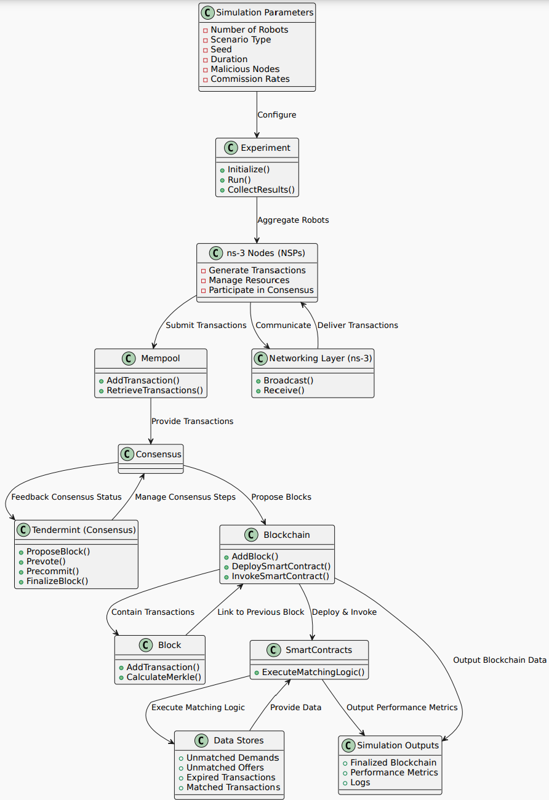
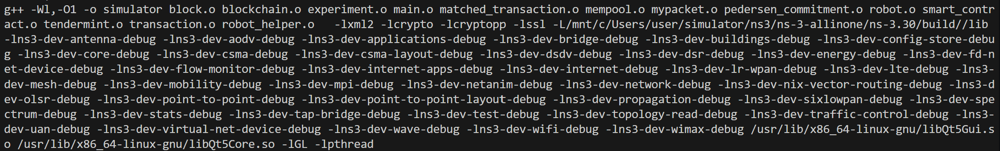
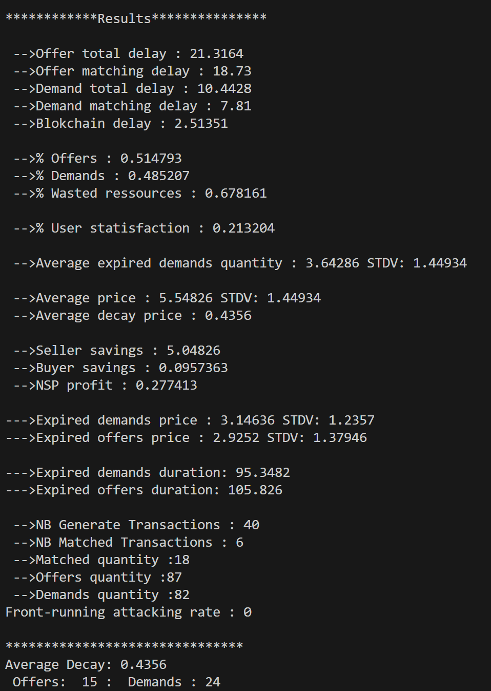

# Trade-5G Simulation using NS3

## Table of Contents

1. [Introduction](#introduction)
2. [Workflow Overview](#workflow-overview)
3. [Features](#features)
<!-- 4. [Architecture](#architecture) -->
5. [Installation Guide](#installation-guide)
    - [1. Install NS3 Requirements](#1-install-ns3-requirements)
    - [2. Download and Install NS3](#2-download-and-install-ns3)
    - [3. Add RapidJSON (for Serialization/Deserialization of Packets)](#3-add-rapidjson-for-serializationdeserialization-of-packets)
    - [4. Build NS3 using WAF](#4-build-ns3-using-waf)
    - [5. Build the Simulator](#5-build-the-simulator)
6. [Usage](#usage)
    - [Running the Simulator](#running-the-simulator)
    - [Parameter Configuration](#parameter-configuration)
    - [Batch Simulation Execution](#batch-simulation-execution)
7. [Code Structure](#code-structure)
    - [Key Components](#key-components)
        - [Experiment (`experiment.cc`)](#1-experiment-experimentcc)
        - [Robot (`robot.cc` & `robot.h`)](#2-robot-robotcc--roboth)
        - [Utilities (`utils.h`)](#3-utilities-utilsh)
8. [Results](#results)
    - [Sample Output](#sample-output)
9. [Contact](#contact)
10. [References](#references)

---

## Introduction

The **Trade-5G Simulation using NS3** is a simulator designed for a blockchain-based trading environment specifically tailored for network operators and robots (blockchain maintainers). This simulator models the interactions within a decentralized market, enabling the study of transaction dynamics, consensus mechanisms, and resource management in a controlled environment.

---

## Workflow Overview



*Figure 1: Simulator Workflow Diagram*

The workflow encompasses the following stages:

1. **Network Setup:** Establishes the network topology using NS3.
2. **Robot Deployment:** Initializes robots that act as blockchain maintainers.
3. **Transaction Generation:** Simulates offers and demands based on predefined scenarios.
4. **Consensus Mechanism:** Implements the Tendermint consensus protocol for block validation.
5. **Data Collection:** Gathers and analyzes simulation results.

---

## Features

- **Decentralized Network Simulation:** Models a network of robots acting as blockchain maintainers.
- **Transaction Generation:** Simulates offers and demands with configurable parameters.
- **Consensus Mechanism:** Implements the Tendermint consensus protocol for block validation.
- **Resource Management:** Tracks and manages resources within the network.
- **Scenario-Based Simulations:** Supports various market scenarios like high demand low offer, random, and low demand high offer.
- **Comprehensive Statistics:** Generates detailed results on latency, resource utilization, price volatility, and more.
- **Extensible Architecture:** Easily extendable with additional smart contracts and scenarios.

<!-- ---

## Architecture

*Include a diagram or description of the system architecture here.*

--- -->

## Installation Guide

Follow the steps below to install, configure, and build the simulation environment.

### 1. Install NS3 Requirements

Ensure you have all the necessary dependencies for NS3. Follow the [NS3 Installation Guide](https://www.nsnam.org/wiki/Installation) for detailed instructions.

### 2. Download and Install NS3

1. **Create a Directory for NS3:**

    ```bash
    mkdir ns3
    cd ns3
    ```

2. **Clone the NS3 Repository:**

    ```bash
    git clone https://gitlab.com/nsnam/ns-3-allinone.git
    ```

3. **Download the Specific Version of NS3 Used in This Project (v3.29):**

    ```bash
    ./ns-3-allinone/ns-3.29/waf configure
    ```

### 3. Add RapidJSON 

1. **Return to the Workspace Root:**

    ```bash
    cd ..
    ```

2. **Clone the RapidJSON Library:**

    ```bash
    git clone https://github.com/Tencent/rapidjson.git
    ```

3. **Run the Installation Script:**

    ```bash
    ./install_script.sh
    ```

    *Note: Ensure that `install_script.sh` correctly places RapidJSON in the appropriate directory or adjusts include paths as necessary.*

### 4. Build NS3 using WAF

1. **Navigate to the NS3 Directory:**

    ```bash
    cd ns3/ns-allinone-3.29/ns-3.29
    ```

2. **Configure the Build Environment:**

    ```bash
    CXXFLAGS="-std=c++14" ./waf configure --enable-static
    ```

3. **Build NS3:**

    ```bash
    ./waf
    ```

### 5. Build the Simulator

1. **Unzip the Simulator Files to Your Workspace.**

2. **Navigate to the Application Model Directory:**

    ```bash
    cd simulation/src/application/model/
    ```

3. **Update the `NS_BUILD_DIR` in `model.pro` if Necessary.**

    Open `model.pro` and ensure that the `NS_BUILD_DIR` points to the correct NS3 build directory (e.g., `../ns3/ns-allinone-3.29/ns-3.29/build/`).

4. **Set the `LD_LIBRARY_PATH` Environment Variable:**

    ```bash
    export LD_LIBRARY_PATH=../ns3/ns-allinone-3.29/ns-3.29/build/lib
    ```

    *Replace the path with the actual `NS_BUILD_DIR` used in `model.pro`.*

5. **Reload Environment Variables:**

    ```bash
    source ~/.bashrc
    ```

6. **Install Qt5 for Building the GUI (If Applicable):**

    ```bash
    sudo apt-get install qt5-default
    ```

7. **Build the Simulator:**

    ```bash
    qmake
    make clean
    make
    ```

    *Ensure that the build process completes without errors.*



*Figure 2: Build Process Result*

---

## Usage

### Running the Simulator

Once the simulator is built, you can run it using the following command:

```bash
./simulator [parameters]
```

**Example:**

```bash
./simulator --nb_robots=4 --scenario=0 --seed=42 --malicious=0 --commission=5 --duration=1000
```



*Figure 3: Simulation Output*

### Parameter Configuration

The simulator accepts various parameters to customize the simulation environment. Below is a list of available parameters:

| Parameter      | Description                                        | Example Value                |
|----------------|----------------------------------------------------|------------------------------|
| `--nb_robots`  | Total number of robots (blockchain maintainers)    | `4`                          |
| `--scenario`   | Defines the market scenario                        | `0` for HIGH_DEMAND_LOW_OFFER |
| `--seed`       | Seed for random number generation                  | `42`                         |
| `--malicious`  | Number of malicious robots in the network          | `1`                          |
| `--commission` | Transaction commission rate (%)                    | `5`                          |
| `--duration`   | Total duration of the simulation in seconds        | `1000`                       |

**Scenario Types:**

| Value | Scenario Type                     |
|-------|-----------------------------------|
| `0`   | HIGH_DEMAND_LOW_OFFER             |
| `1`   | LOW_DEMAND_HIGH_OFFER             |
| `2`   | RANDOM                            |

### Batch Simulation Execution

To efficiently run multiple simulations with varying parameter combinations, the provided batch script [`bash/run.sh`](protocol/src/applications/bash/run.sh) automates the process. This script allows you to explore different configurations, such as the number of robots, scenarios, durations, and more.

#### How to Use

1. **Open the Script:**

    Open [`bash/run.sh`](protocol/src/applications/bash/run.sh) and customize the parameter ranges to fit your experiment. The key parameters include:
    - **`SCENARIOS`**: Define the type of simulation scenarios (e.g., high demand, low supply).
    - **`N_VALUES`**: Set the number of robots participating in the simulation.
    - **`DURATION_VALUES`**: Specify the simulation durations.
    - **`SEEDS`**: Provide random seeds for reproducibility.

2. **Make the Script Executable:**

    ```bash
    chmod +x batch/run.sh
    ```

3. **Execute the Script:**

    ```bash
    ./batch/run.sh
    ```

---

## Code Structure

Understanding the code structure will help you navigate and extend the simulator effectively.

### Key Components

#### 1. Experiment (`experiment.cc`)

**Purpose:**

- Sets up the simulation environment.
- Creates and places robot nodes.
- Establishes network connections.
- Installs robot applications on the nodes.
- Runs the simulation and collects results.

**Key Functions:**

- `Experiment::Experiment(...)`: Constructor initializing simulation parameters and creating nodes.
- `Experiment::CreateNetwork()`: Establishes the network topology using point-to-point links.
- `Experiment::Install()`: Deploys robot applications on the nodes.
- `Experiment::Run()`: Executes the simulation.
- `Experiment::Results()`: Gathers and outputs simulation results.

#### 2. Robot (`robot.cc` & `robot.h`)

**Purpose:**

- Represents blockchain maintainers (robots) that handle transactions.
- Manages transaction generation, broadcasting, and consensus participation.
- Implements the Tendermint consensus protocol for block validation.

**Key Classes and Methods:**

- **Robot Class:**
    - `StartApplication()`: Initializes the robot, sets up sockets, and starts transaction generation.
    - `GenerateTransaction()`: Creates transactions based on the defined scenario.
    - `SendPropose()`, `SendPrevote()`, `SendPrecommit()`: Handle different phases of the Tendermint consensus.
    - `HandleRead()`: Processes incoming packets.
    - `MatchingLogic()`: Matches offers and demands within a block.
    - `InvokeSmartContract()`: Executes smart contracts upon block confirmation.

- **RobotStatics Struct:**
    - Tracks statistics like expired offers and demands.

- **RobotParameter Struct:**
    - Holds configurable parameters for the robot’s behavior.

#### 3. Utilities (`utils.h`)

**Purpose:**

- Provides helper functions and defines protocol parameters essential for simulation.

**Key Functions and Definitions:**

- **Helper Functions:**
    - `GetSeconds()`: Returns the current simulation time in seconds.
    - `dump()`, `toBinary()`: Data conversion utilities.
    - `stream2hex()`, `hex2stream()`: Hexadecimal conversions.
    - `tokenize()`: Splits strings based on delimiters.
    - `SerializeCharBuffer()`, `DeserializeCharBuffer()`: Handles JSON serialization/deserialization.
    - `HashDataBuffer()`: Generates SHA1 hash of data.

- **Constants and Enums:**
    - Defines various constants like delays, transaction sizes, and Tendermint parameters.
    - Enumerations for `ScenarioType`, `TRADE_TYPE`, `SMARTCONTRACTS`, and `RESSOURCE_TYPE`.

---

## Results

After running simulations, results are generated and saved in the `results` directory. Key outputs include:

- **Latency Metrics:**
    - Average total delay for offers and demands.
    - Matching delays and blockchain confirmation times.

- **Resource Utilization:**
    - Percentage of offers vs. demands.
    - Wasted resources due to expired offers or demands.

- **Price Volatility:**
    - Average transaction prices and their standard deviations.
    - Decay rates and buyer/seller savings.

- **User Satisfaction:**
    - Metrics indicating the efficiency and satisfaction levels within the network.

- **Security Metrics:**
    - Front-running attack rates based on malicious robots.

### Sample Output (`latency.csv`):

```csv
nb_robots,scenario,seed,duration,avg_offer_delay,avg_demand_delay,avg_blockchain_delay,percent_offers,percent_demands,wasted_resources,matched_quantity,malicious,attack_rate,commission,avg_seller_savings,avg_buyer_profit,nsp_profit,average_price
20,0,100,2000,0.05,0.04,0.02,0.6,0.4,0.1,500,5,0.05,10,5,3,1.5,8
```

**Explanation of Columns:**

- `nb_robots`: Number of robots in the simulation.
- `scenario`: Scenario type identifier.
- `seed`: Seed value for random number generation.
- `duration`: Duration of the simulation in seconds.
- `avg_offer_delay`: Average delay for offers.
- `avg_demand_delay`: Average delay for demands.
- `avg_blockchain_delay`: Average delay for blockchain confirmations.
- `percent_offers`: Percentage of offers in total transactions.
- `percent_demands`: Percentage of demands in total transactions.
- `wasted_resources`: Percentage of resources wasted due to expired transactions.
- `matched_quantity`: Total quantity of matched transactions.
- `malicious`: Number of malicious robots.
- `attack_rate`: Rate of front-running attacks.
- `commission`: Transaction commission rate.
- `avg_seller_savings`: Average savings for sellers.
- `avg_buyer_profit`: Average profit for buyers.
- `nsp_profit`: Profit for the network service provider (NSP).
- `average_price`: Average transaction price.

---

## Contact

For any questions or suggestions, feel free to reach out:

**ORCID:** [0000-0002-7989-8962](https://orcid.org/0000-0002-7989-8962)

---

## References

- **NS3 Documentation:** [https://www.nsnam.org/docs/release/3.35/](https://www.nsnam.org/docs/release/3.35/)
- **Bitcoin-Simulator:** [https://github.com/arthurgervais/Bitcoin-Simulator](https://github.com/arthurgervais/Bitcoin-Simulator)
- **Tendermint Documentation:** [https://docs.tendermint.com/](https://docs.tendermint.com/)
- **Blockchain Basics:** [https://en.wikipedia.org/wiki/Blockchain](https://en.wikipedia.org/wiki/Blockchain)

---
